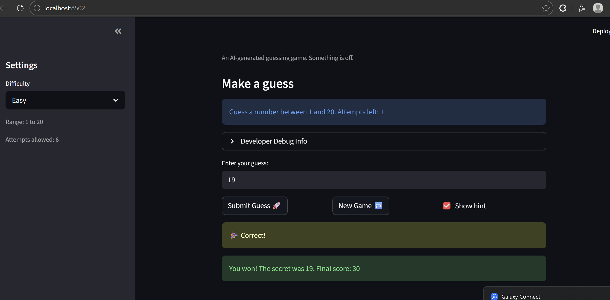

# 🎮 Game Glitch Investigator: The Impossible Guesser

## 🚨 The Situation

You asked an AI to build a simple "Number Guessing Game" using Streamlit.
It wrote the code, ran away, and now the game is unplayable. 

- You can't win.
- The hints lie to you.
- The secret number seems to have commitment issues.

## 🛠️ Setup

1. Install dependencies: `pip install -r requirements.txt`
2. Run the broken app: `python -m streamlit run app.py`

## 🕵️‍♂️ Your Mission

1. **Play the game.** Open the "Developer Debug Info" tab in the app to see the secret number. Try to win.
2. **Find the State Bug.** Why does the secret number change every time you click "Submit"? Ask ChatGPT: *"How do I keep a variable from resetting in Streamlit when I click a button?"*
3. **Fix the Logic.** The hints ("Higher/Lower") are wrong. Fix them.
4. **Refactor & Test.** - Move the logic into `logic_utils.py`.
   - Run `pytest` in your terminal.
   - Keep fixing until all tests pass!

## 📝 Document Your Experience

- [ ] Describe the game's purpose.
- [ ] Detail which bugs you found.
- [ ] Explain what fixes you applied.

To be complety honest it was a long and hard experiece but I got to learn alot from it. I had never used GIT or github before and figuring it out by watching lots of videos and chats with ai tooks many many hours. The game's pupose was to have the person play a guessing game in which they had to guess the secret number. Some of the bug I found was it was giving incorrect guesses. If the guessed number was too high it was say guess was too low and vice versa. The fix I applied was changing the sings in the logic so it it with the correct output statement. Another bug was the name game button didn't work. I didn't know at all how to to that since I had no expeience with UI. Claude suggeting this line st.session_state.status = "playing". It basically makes sure when you press the new button game the game status is playing instead on completly stoping. Another bug was that the score was in the neagive sometimes. I fixed it it by using the max function in which the lowest the score can be is a 0. It picks from 0 or the current score. Another bug was it was the same range for all the difficulty. I fixed that by making the range for the secret number to be based on the low and high of that diffucily level and then fixing the message that tells people what range to guess from

## 📸 Demo

- [ ] [Insert a screenshot of your fixed, winning game here]

## 🚀 Stretch Features

- [ ] [If you choose to complete Challenge 4, insert a screenshot of your Enhanced Game UI here]
Did not complete Challenge 4
